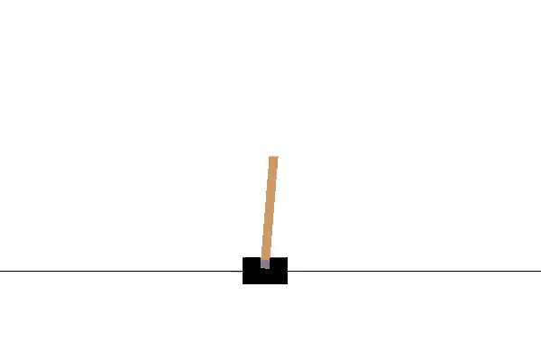
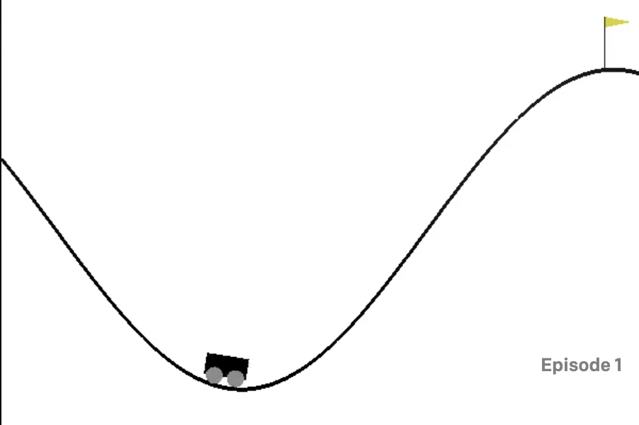

# Pytorch-REINFORCE
pytorch implementation of REINFORCE, a monte carlo， policy network based Reinforcement Learning algorithm

## Policy network
Comparing to value based algorithm like DQN, policy based method straightly generates the probability of every possible action(action distribution). To train such a network, monte carlo is adopted for the purpose of sampling trajectory. Each trajectory possesses its reward, we use gradient ascent to update the network in the direction of maximum reward.
## REINFORCE
REINFORCE let the agent play a whole episode and update the weights using the reward obtained in such a way that the expected reward is maximum. So the expercted reward is:
$$J(\theta) = E_{r~p(r;\theta}[R(\tau)] = \int_\tau r(\tau)p(\tau;\theta)d\tau$$

REINFORCE maximizes the above expection by gradient ascent and a few tricks are used to get the gradient.
$$\nabla \log(J(\theta)) = \sum_{t \le 0} r(\tau)\nabla_\theta log\pi_\theta (a_t|s_t)$$

## implementation

- agent.py: the REINFORCE agent
- network.py: the policy network
- train.py: training entrance
- train_Pong.py: training entrance to Pong
## Training
To start training, first modify the environment name in train.py then

    python train.py

If you want to train on Pong environment

    python train_Pong.py

All the reward with respect to episode is recorded using tensorboard, to check

    tensorboard --logdir=runs
    
## Experiments and results
### Environments
#### CartPole-v0
CartPole-v0 involves a pole on a car and an agent is required to hold control of the car(left/right) in order to prevent the pole from falling. Each step, the agent is rewarded 1 if the pole fails to fall, with a maximum steps of 200.

#### MountainCar-v0
MountainCar-v0 involves a car in a valley and an agent is required to control the car to drive up the mountain on the right. However, the car's engine is not strong enough to scale the mountain in a single pass. Therefore, the agent is required to learn to drive back and forth to build up momentum.

#### Pong-v0
Pong-v0 is a atari2600 game where an agent is trying to play against computer in the environment. The final reward is the score of agent minus the score of the computer.

### 
