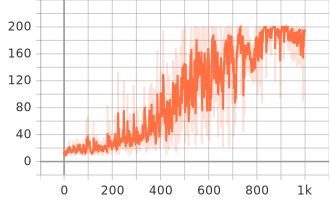
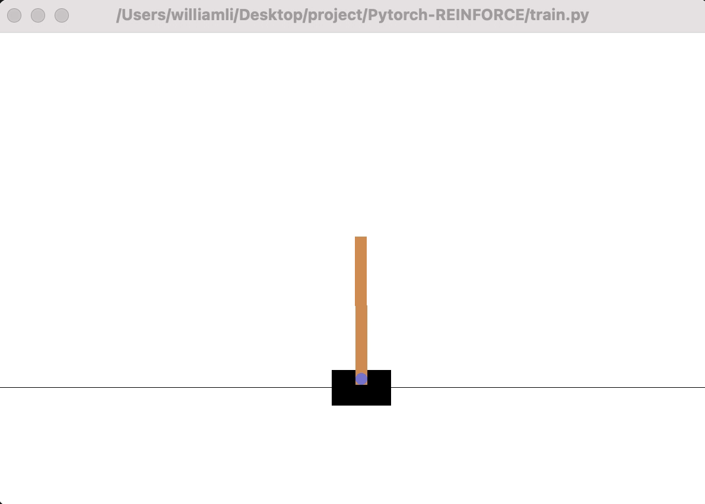

# Pytorch-REINFORCE
pytorch implementation of REINFORCE, a monte carlo， policy network based Reinforcement Learning algorithm

## Policy network
Comparing to value based algorithm like DQN, policy based method straightly generates the probability of every possible action(action distribution). To train such a network, monte carlo is adopted for the purpose of sampling trajectory. Each trajectory possesses its reward, we use gradient ascent to update the network in the direction of maximum reward.
## REINFORCE
REINFORCE let the agent play a whole episode and update the weights using the reward obtained in such a way that the expected reward is maximum. So the expercted reward is:
$$J(\theta) = E_{r~p(r;\theta}[R(\tau)] = \int_\tau r(\tau)p(\tau;\theta)d\tau$$

REINFORCE maximizes the above expection by gradient ascent and a few tricks are used to get the gradient.
$$\nabla \log(J(\theta)) = \sum_{t \le 0} r(\tau)\nabla_\theta log\pi_\theta (a_t|s_t)$$

## implementation

- agent.py: the REINFORCE agent
- network.py: the policy network
- train.py: training entrance
## Training
To start training, first modify the environment name in train.py then

    python train.py

All the reward with respect to episode is recorded using tensorboard, to check

    tensorboard --logdir=runs
    
## Experiments and results
### CartPole-v0
CartPole-v0 involves a pole on a car and an agent is required to hold control of the car(left/right) in order to prevent the pole from falling. Each step, the agent is rewarded 1 if the pole fails to fall, with a maximum steps of 200.

The following is loss with respect to episodes

And a demo of the trained agents

### Pong-v0
Pong-v0 is a atari2600 game where an agent is trying to play against computer in the environment. The final reward is the score of agent minus the score of the computer.

